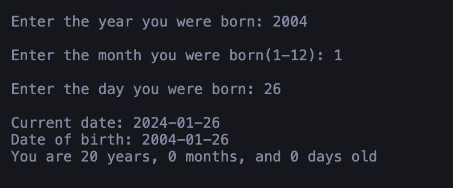
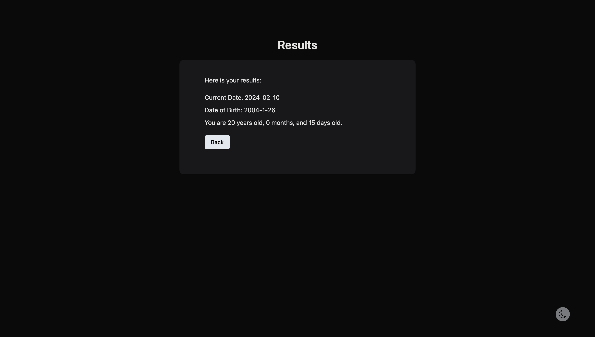

<h1 style="text-align:center;">Compute Age 🦄</h1>
<p>From the Terminal to the User Interface, originally created in Java, this web app helps to calculate your age</p>

#

<p align="center">
    
</p>
<h3 style="text-align:center;">⬇</h3>

<p align="center">
    
    
</p>

## 🌎 Set up 🛠
#
I. Install the dependencies

```bash
$ npm install
or 
$ bun install
```

II. Start the development server

```bash
$ npm run dev
or 
$ bun run dev
```

## 🛫 Build and run production ⚙️
#

```bash
$ npm run build
or 
$ bun run build
```